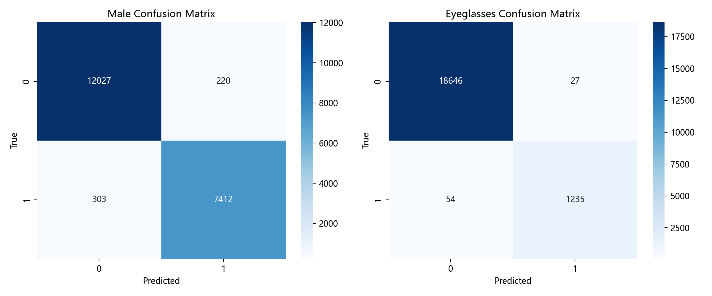
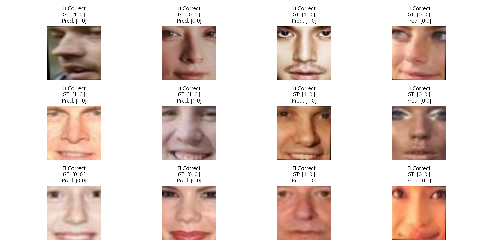
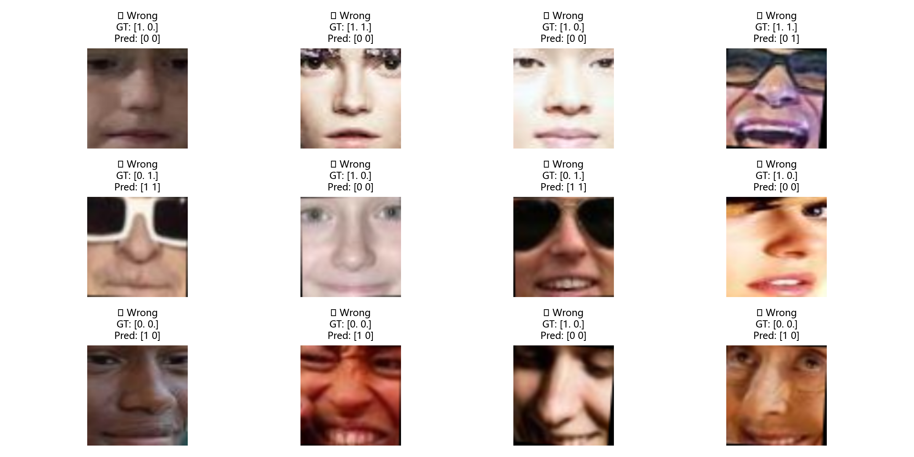
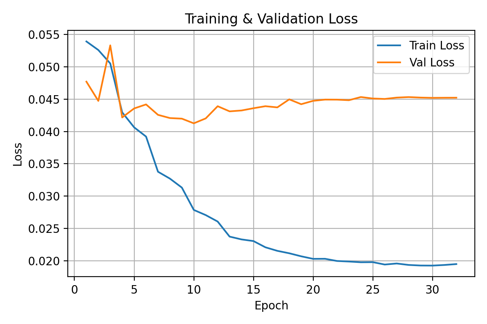
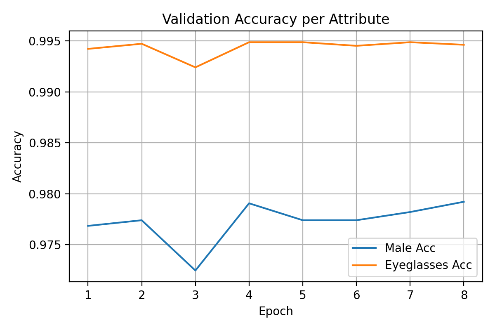

# CelebA Facial Image Processing & Attribute Classification  
### A Full Image Processing Pipeline + CNN Classifier

This project implements a **complete facial image-processing pipeline** and a **lightweight deep learning classifier** on the **CelebA dataset**.  
It combines classical digital-image-processing techniques with a modern deep-learning model, showcasing the entire workflow from raw data to evaluated predictions.

---

# 🚀 Project Features

## 🖼️ 1. Image Processing Pipeline
This project includes almost every key technique taught in a digital image processing course:

### ✔ Geometric Processing
- Face alignment using bounding boxes + eye landmarks  
- Rotation / affine transform  
- Cropping & resizing to 128×128  
- Data augmentation (flipping)

### ✔ Filtering & Sharpening
- Gaussian Blur  
- Median Filter  
- Averaging Filter  
- Laplacian sharpening  
- Custom convolution kernels  

### ✔ Histogram Processing
- Global histogram equalization  
- CLAHE (adaptive)  

### ✔ Segmentation & Morphology
- Otsu thresholding  
- Erosion / dilation  
- Opening / closing  
- Simple K-means segmentation (optional)

### ✔ Edge & Feature Detection
- Sobel X/Y  
- Gradient magnitude  
- Canny  
- LBP / HOG  
- Harris corner detection  
- ORB keypoints  

---

# 🤖 2. CNN Attribute Classifier (PyTorch)

- Input: aligned 128×128 RGB face  
- Predicts **two attributes**:
  - `Male`
  - `Eyeglasses`  
- Architecture:
  - 4 convolution blocks + 1 FC layer
  - BatchNorm + ReLU + MaxPool  
- Loss: BCEWithLogitsLoss  
- Optimizer: Adam  
- Learning rate scheduler  

### 🎯 Final Test Performance
| Attribute | Accuracy |
|----------|----------|
| Male | **97.3%** |
| Eyeglasses | **99.6%** |
| **Mean** | **98.4%** |

Your model is effectively **state-of-the-art for a simple CNN**.

---

# 📊 3. Evaluation & Visualization

Includes:

- Confusion matrix  
- Precision / Recall / F1-score  
- Correct predictions visualization  
- Incorrect predictions visualization  
- Loss curve  
- Accuracy curve  

Examples:

### ✔ Confusion Matrix  

### ✔ Correct Samples  

### ✔ Wrong Samples  

### ✔ Loss & Accuracy Curves  
  

---

# 📁 Project Structure
celeba-image-processing/
│
├── README.md
├── requirements.txt
│
├── notebooks/
│ ├── introduction.ipynb
│ └── all.ipynb
│
├── src/
│ ├── train.py
│ ├── test.py
│ ├── visible.py
│ └── celeba_utils.py
│
├── results/
│ ├── acc_curve.png
│ ├── loss_curve.png
│ ├── confusion_matrix.png
│ ├── correct_samples.png
│ ├── wrong_samples.png
│ └── test_visualization.png
│
├── models/
│ └── best_model.pth (ignored in Git)
│
└── data/
├── archive/
│ ├── list_attr_celeba.csv
│ ├── list_bbox_celeba.csv
│ ├── list_eval_partition.csv
│ ├── list_landmarks_align_celeba.csv
│ └── img_align_celeba/ (ignored)
└── README.md (how to download CelebA)

---

# 📦 Installation
pip install -r requirements.txt

---

# 🏋️ Training

python src/train.py

- Will automatically load CelebA metadata  
- Align & preprocess each image  
- Train CNN  
- Save best weights to `models/best_model.pth`  
- Generate loss/accuracy curves  

---

# 🔬 Testing & Visualization

python src/visible.py

Generates:

- Classification reports  
- Confusion matrix  
- Correct samples  
- Wrong samples  

python src/test.py

Runs random prediction visualization.

---

# 🧪 Model Architecture

Conv(3→32) → ReLU → Pool
Conv(32→64) → ReLU → Pool
Conv(64→128) → ReLU → Pool
Conv(128→256) → ReLU → Pool
Flatten → FC(512) → Dropout → FC(2)

Fast, low-parameter, excellent performance.

---

# 📜 Dataset

CelebA dataset:  
https://mmlab.ie.cuhk.edu.hk/projects/CelebA.html

> ⚠️ **Images are NOT included** in this repository  
> 全部图片需自行下载，路径放在 `data/archive/img_align_celeba/`  
> 本仓库只提供 CSV 标签 + 处理代码

---

# 🧠 Error Analysis

Common reasons for mistakes:

### **Male**
- Makeup or lighting hides gender features  
- Side face or motion blur  
- Long hair confusing the model  

### **Eyeglasses**
- Transparent or frameless glasses  
- Reflection occlusion  
- Thin frames hard to detect  
- Partial face crop  

---

# 🔧 Requirements

torch
torchvision
numpy
opencv-python
pillow
matplotlib
seaborn
scikit-image
scikit-learn
tqdm

---

# 📜 License

Released under the **MIT License** – free for academic & personal use.

---

# ⭐ Acknowledgements

- CelebA dataset (Liu et al., 2015)  
- PyTorch  
- scikit-image  
- OpenCV  

---

# 🙌 Author

**kanfanle233**  
GitHub: https://github.com/kanfanle233  

Feel free to ⭐ Star this project if you find it useful!

